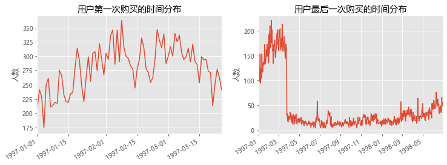

<h1>Table of Contents<span class="tocSkip"></span></h1>
<div class="toc"><ul class="toc-item"><li><span><a href="#数据源" data-toc-modified-id="数据源-1"><span class="toc-item-num">1&nbsp;&nbsp;</span>数据源</a></span></li><li><span><a href="#项目介绍：" data-toc-modified-id="项目介绍：-2"><span class="toc-item-num">2&nbsp;&nbsp;</span>项目介绍：</a></span></li><li><span><a href="#观察数据集" data-toc-modified-id="观察数据集-3"><span class="toc-item-num">3&nbsp;&nbsp;</span>观察数据集</a></span></li><li><span><a href="#用户首购和最后一次购买的时间分布情况:" data-toc-modified-id="用户首购和最后一次购买的时间分布情况:-4"><span class="toc-item-num">4&nbsp;&nbsp;</span>用户首购和最后一次购买的时间分布情况:</a></span></li><li><span><a href="#用户购买周期情况：" data-toc-modified-id="用户购买周期情况：-5"><span class="toc-item-num">5&nbsp;&nbsp;</span>用户购买周期情况：</a></span></li><li><span><a href="#用户生命周期情况：" data-toc-modified-id="用户生命周期情况：-6"><span class="toc-item-num">6&nbsp;&nbsp;</span>用户生命周期情况：</a></span></li><li><span><a href="#用户分层分析：" data-toc-modified-id="用户分层分析：-7"><span class="toc-item-num">7&nbsp;&nbsp;</span>用户分层分析：</a></span></li><li><span><a href="#每月用户活动状态分析：" data-toc-modified-id="每月用户活动状态分析：-8"><span class="toc-item-num">8&nbsp;&nbsp;</span>每月用户活动状态分析：</a></span></li><li><span><a href="#每月回流用户占比：" data-toc-modified-id="每月回流用户占比：-9"><span class="toc-item-num">9&nbsp;&nbsp;</span>每月回流用户占比：</a></span></li><li><span><a href="#用户复购率指标：" data-toc-modified-id="用户复购率指标：-10"><span class="toc-item-num">10&nbsp;&nbsp;</span>用户复购率指标：</a></span></li><li><span><a href="#用户回购率指标：" data-toc-modified-id="用户回购率指标：-11"><span class="toc-item-num">11&nbsp;&nbsp;</span>用户回购率指标：</a></span></li><li><span><a href="#用户每月留存率情况：" data-toc-modified-id="用户每月留存率情况：-12"><span class="toc-item-num">12&nbsp;&nbsp;</span>用户每月留存率情况：</a></span></li></ul></div>

# CD网站数据用户行为分析

## 数据源
>来自国外网站  
>链接: https://pan.baidu.com/s/1FnGRHejNZo1Vxe-6Qk4l7Q  提取码: uzhx 

## 项目介绍： 
本篇文章旨在对国外某一CD消费网站的用户购买记录进行分析，主要围绕平台整体消费情况和用户行为展开分析叙述，通过分析该网站基本消费情况，找出高价值用户人群，及用户留存、活跃、流失等情况，为平台指定策略提供数据分析支持和建议。

**分析的主要框架**：   
1、平台整体消费情况  
2、各月份消费差异分析  
3、用户消费情况分析  
4、用户消费行为分析  
5、用户分层   
6、用户每月活动状态分析  
7、用户回购率、复购率、留存率分析  

## 观察数据集


```python
import pandas as pd
import numpy as np
import matplotlib.pyplot as plt
import seaborn as sns
# 避免在显示统计图时 plt.show()
%matplotlib inline 
plt.style.use('ggplot')
plt.rcParams['font.sans-serif']=['Microsoft YaHei'] #用来正常显示中文标签
plt.rcParams["axes.unicode_minus"]=False   #正常显示负号

Column = ['user_id','order_dt','order_products','order_amount']
df = pd.read_csv(r'data/CDNOW_master.txt',encoding='gbk',sep='\s+',names=Column)
df.info()

```

    <class 'pandas.core.frame.DataFrame'>
    RangeIndex: 69659 entries, 0 to 69658
    Data columns (total 4 columns):
    user_id           69659 non-null int64
    order_dt          69659 non-null int64
    order_products    69659 non-null int64
    order_amount      69659 non-null float64
    dtypes: float64(1), int64(3)
    memory usage: 2.1 MB


原始数据共有4个字段，共69659行，数据比较完整没有缺失值，各字段含义比较简单：  
user_id:用户id  
order_dt:订单时间  
order_products:订单的购买产品数  
order_amount:订单的话费金额   
order_dt为整数类型，显然需要进行数据类型转化，再者为方便后续对月份的分析，需要增加一个新的字段month，表示订单的月份；


```python
df['order_dt'] = pd.to_datetime(df.order_dt, format='%Y%m%d')
df['month'] = df.order_dt.astype('datetime64[M]')
df.head()
```


<div>
<style scoped>
    .dataframe tbody tr th:only-of-type {
        vertical-align: middle;
    }

    .dataframe tbody tr th {
        vertical-align: top;
    }

    .dataframe thead th {
        text-align: right;
    }
</style>
<table border="1" class="dataframe">
  <thead>
    <tr style="text-align: right;">
      <th></th>
      <th>user_id</th>
      <th>order_dt</th>
      <th>order_products</th>
      <th>order_amount</th>
      <th>month</th>
    </tr>
  </thead>
  <tbody>
    <tr>
      <th>0</th>
      <td>1</td>
      <td>1997-01-01</td>
      <td>1</td>
      <td>11.77</td>
      <td>1997-01-01</td>
    </tr>
    <tr>
      <th>1</th>
      <td>2</td>
      <td>1997-01-12</td>
      <td>1</td>
      <td>12.00</td>
      <td>1997-01-01</td>
    </tr>
    <tr>
      <th>2</th>
      <td>2</td>
      <td>1997-01-12</td>
      <td>5</td>
      <td>77.00</td>
      <td>1997-01-01</td>
    </tr>
    <tr>
      <th>3</th>
      <td>3</td>
      <td>1997-01-02</td>
      <td>2</td>
      <td>20.76</td>
      <td>1997-01-01</td>
    </tr>
    <tr>
      <th>4</th>
      <td>3</td>
      <td>1997-03-30</td>
      <td>2</td>
      <td>20.76</td>
      <td>1997-03-01</td>
    </tr>
  </tbody>
</table>
</div>


# 整体消费情况

描述统计分析，观察平台的整体消费规模，用户流量和平均消费能力，从而大致了解平台情况；


```python
print('对用户用户数据整体求和：\n',df.sum())
print('\n统计情况：\n',df.describe())
print('\n件单价：\n',df.order_amount.sum()/df.order_products.sum())
print('\n客单价：\n',df.order_amount.sum()/len(df.user_id.unique()))

```

    对用户用户数据整体求和：
     user_id           7.990483e+08
    order_products    1.678810e+05
    order_amount      2.500316e+06
    dtype: float64
    
    统计情况：
                 user_id  order_products  order_amount
    count  69659.000000    69659.000000  69659.000000
    mean   11470.854592        2.410040     35.893648
    std     6819.904848        2.333924     36.281942
    min        1.000000        1.000000      0.000000
    25%     5506.000000        1.000000     14.490000
    50%    11410.000000        2.000000     25.980000
    75%    17273.000000        3.000000     43.700000
    max    23570.000000       99.000000   1286.010000
    
    件单价：
     14.893380608883676
    
    客单价：
     106.08042554094189


- 平台规模：该CD购买平台总的消费金额是250万，所销售的产品数为16.7万件
- 订单金额：平台上每笔订单的平均消费金额约36元，中位数约26元，标准差约36元，说明数据离散程度较大，存在极大值的干扰。
- 订单产品数：平台上每笔订单平均购买产品数为2.4件，中位数为2件，75%的订单产品数为3件，说明大多数用户每笔订单都是2或3件，存在极大值干扰。
- 件单价：每个产品的价格约为15元
- 客单价：每个用户平均购买金额为106元

# 各月份消费差异分析
>分析不同月份平台的消费总额、消费产品数、订单数、消费人数和客单价，从而发现月份消费差异；


```python
group_month=df.groupby('month')
fig,axes=plt.subplots(1,4,figsize=(16,4))
axes0,axes1,axes2,axes3=axes.flatten()
# 每月销售金额
group_month.order_amount.agg('sum').plot(marker='o',ax=axes0)
axes0.set_title('每月消费金额')
axes0.set_ylabel('消费金额')
# 每月销售产品数
group_month.order_products.sum().plot(marker='o',ax=axes1)
axes1.set_title('每月销售产品数')
axes1.set_ylabel('销售产品数')
# 每月订单数
group_month.order_products.count().plot(marker='o',ax=axes2)
axes2.set_title('每月订单数')
axes2.set_ylabel('订单数')
group_month.user_id.unique().apply(lambda x:len(x)).plot(marker='o',ax=axes3)
axes3.set_title('每月客户数')
axes3.set_ylabel('客户数')
```


    Text(0, 0.5, '客户数')


**不同月份之间销售金额、销售产品数、订单数和客户数等四项指标对比分析**：  
从图表可以发现在前三个月，平台的销售金额、销售产品数和订单数都是比较高的，且都是第三个月出现峰值，单月销售金额最高达到39万、销售产品数最高达到2.6万件、订单数最高达到1.2万单、购买客户数最高达到8900人。**但从第4个月开始，平台各项销售数据出现严重的下降，虽然后续保持稍平稳的状态，但总体趋势也是下降，说明平台经营趋向不健康发展。**


```python
fig,axes=plt.subplots(2,1,figsize=(10,4))
axes0,axes1=axes.flatten()
# 每月客单价
group_month_pct=group_month.order_amount.sum()/group_month.user_id.unique().apply(lambda x:len(x))
group_month_pct.plot(marker='o',ax=axes0)
axes0.set_title('每月客单价')
axes0.set_ylabel('客单价')
# 每月件单价
group_month_up=group_month.order_amount.sum()/group_month.order_products.sum()
group_month_up.plot(ax=axes1,marker='o')
axes1.set_title('每月件单价')
axes1.set_ylabel('件单价')
```


    Text(0, 0.5, '件单价')


不同月份**客单价、件单价**对比分析：

**客单价分析**：前三个月的客单价最低，之所以这段期间消费金额最大，主要依赖于这三个月的客户人数也是最多的，**后续客户流失导致每月的销售金额也减少**；
**件单价分析**：前三个月件单价比高，但是客户购买人数也多，尽管第四个月起件单价整体是降低的，但是客户却整体减少，**说明价格不是主要影响客户流失的原因**，需要平台的运营人员分析经营过程出现的问题；

# 用户消费情况分析

>用户消费情况分析：  
1、用户消费金额、消费次数和购买产品数量的描述统计;  
2、用户关于消费金额、消费次数和购买产品数量的区间分布;  
3、用户消费金额和购买产品数量的回归分析;  
4、观察是否符合二八法则；  
从而了解用户整体消费水平和能力；  


```python
group_user=df.groupby('user_id')
group_user_des=group_user[['order_amount','order_products','order_dt',]].agg({"order_amount":'sum','order_products':'sum','order_dt':'count'}).describe()
group_user_des.rename(columns={'order_dt':'con_freq','order_amount':'con_amount','order_products':'num_of_pur'})

```


<div>
<style scoped>
    .dataframe tbody tr th:only-of-type {
        vertical-align: middle;
    }

    .dataframe tbody tr th {
        vertical-align: top;
    }

    .dataframe thead th {
        text-align: right;
    }
</style>
<table border="1" class="dataframe">
  <thead>
    <tr style="text-align: right;">
      <th></th>
      <th>con_amount</th>
      <th>num_of_pur</th>
      <th>con_freq</th>
    </tr>
  </thead>
  <tbody>
    <tr>
      <th>count</th>
      <td>23570.000000</td>
      <td>23570.000000</td>
      <td>23570.000000</td>
    </tr>
    <tr>
      <th>mean</th>
      <td>106.080426</td>
      <td>7.122656</td>
      <td>2.955409</td>
    </tr>
    <tr>
      <th>std</th>
      <td>240.925195</td>
      <td>16.983531</td>
      <td>4.736558</td>
    </tr>
    <tr>
      <th>min</th>
      <td>0.000000</td>
      <td>1.000000</td>
      <td>1.000000</td>
    </tr>
    <tr>
      <th>25%</th>
      <td>19.970000</td>
      <td>1.000000</td>
      <td>1.000000</td>
    </tr>
    <tr>
      <th>50%</th>
      <td>43.395000</td>
      <td>3.000000</td>
      <td>1.000000</td>
    </tr>
    <tr>
      <th>75%</th>
      <td>106.475000</td>
      <td>7.000000</td>
      <td>3.000000</td>
    </tr>
    <tr>
      <th>max</th>
      <td>13990.930000</td>
      <td>1033.000000</td>
      <td>217.000000</td>
    </tr>
  </tbody>
</table>
</div>


**用户消费金额、消费次数、购买产品数的描述统计**：      
1、用户消费金额整体情况：用户平均消费金额为106元，中位数为43元，标准差为240元，说明用户消费差异较大，存在极大值干扰；  
2、用户消费次数整体情况：用户平均消费次数为3次，中位数为1次，标准差为4.7次，也是由于用户消费差异大的影响；  
3、用户购买产品数整体情况：用户平均购买产品数为7件，中卫数为3件，标准差为16次，同样是用户消费差异大造成的影响  


```python
fig,axes=plt.subplots(1,3,figsize=(16,4))
axes0,axes1,axes2=axes.flatten()

# 用户消费金额的分布情况
group_user.sum().query('order_amount<1000').order_amount.plot.hist(bins=20,ax=axes0)
axes0.set_title('用户消费金额的分布情况')
axes0.set_xlabel('消费金额')
axes0.set_ylabel('人数')
# 用户消费次数的分布情况
group_user.sum().query('order_products<100').order_products.plot.hist(bins=20,ax=axes1)
axes1.set_title('用户消费次数的分布情况')
axes1.set_xlabel('消费次数')
axes1.set_ylabel('人数')
# 用户购买产品数量的分布情况
group_user.count().query('order_dt<20').order_dt.plot.hist(bins=20,ax=axes2)
axes2.set_title('用户购买产品数量的分布情况')
axes2.set_xlabel('购买产品数量')
axes2.set_ylabel('人数')
```


    Text(0, 0.5, '人数')


**用户关于消费金额、消费次数、购买产品数量的区间分布**：   
通过图形更加直观发现绝大多数用户都是属于低金额、低频次的，这也确实符合消费类数据的情况  


```python
group_user.sum().query('order_amount<4000').plot.scatter(x='order_amount',y='order_products',title='用户消费金额与购买产品数量的散点图',figsize=(6,4))

```


    <matplotlib.axes._subplots.AxesSubplot at 0x7ff4cbef5510>


**用户消费金额与购买产品数量之间的关系分析**：   
通过散点图，可以发现用户消费金额与购买产品数量之间存在一定的线性关系，因为该平台销售的是单一产品CD，在价格上基本变动不大，从而产生这样的线性关系.


```python
group_user_cum=group_user.sum().sort_values('order_amount').apply(lambda x:x.cumsum()/x.sum())
group_user_cum.reset_index().order_amount.plot(figsize=(6,4))
plt.title('用户消费金额占比')
plt.xlabel('用户数量')
plt.ylabel('消费金额占比')
```


    Text(0, 0.5, '消费金额占比')


**用户消费的二八法则分析**：   
从图可以发现，约85%（约20000名）用户消费金额累计贡献占比仅40%，消费金额排名前15%（约3500名）的用户消费金额累计贡献占高达60%。符合消费数据类的二八法则。

# 用户消费行为分析
>用户消费行为分析：  
>1、用户第一次购买、最后一次购买的时间分布；  
>2、用户购买周期的描述统计；  
>3、用户生命周期的描述统计和分布；  


```python
group_user=df.groupby('user_id')

fig,axes=plt.subplots(1,2,figsize=(12,4))
axes0,axes1=axes.flatten()
# 用户第一次购买的时间分布
group_user.order_dt.min().value_counts().plot(ax=axes0)
axes0.set_title('用户第一次购买的时间分布')
axes0.set_ylabel('人数')
# 用户最后一次购买的时间分布
group_user.order_dt.max().value_counts().plot(ax=axes1)
axes1.set_title('用户最后一次购买的时间分布')
axes1.set_ylabel('人数')
```


    Text(0, 0.5, '人数')





## 用户首购和最后一次购买的时间分布情况:

**首购情况**：绝大多数用户首购时间都是集中在前3个月,后续无新增用户消费;2月上旬出现新增用户数峰值,后续又出现大幅地下降，可能跟运营活动有关系；  
**最后一次购买情况**：有大部分用户最后一次购买的时间是在前三个月，说明很多用户都是只消费了一次；随着时间的推移，最后一次购买的人数逐渐增加，说明用户逐渐在流失。


```python
# 取一个用户的相邻两个日期做差，除以天做计算
group_user_diff=df.sort_values('order_dt').groupby('user_id').apply(lambda x:(x.order_dt-x.order_dt.shift())/np.timedelta64(1,'D'))
group_user_diff.describe()
```


    count    46089.000000
    mean        68.973768
    std         91.033032
    min          0.000000
    25%         10.000000
    50%         31.000000
    75%         89.000000
    max        533.000000
    Name: order_dt, dtype: float64


## 用户购买周期情况： 
从用户购买周期的描述统计结果来看，用户平均消费周期为68天，有50%的订单购买的时间间隔是在31天之内


```python
group_user_lifecycle=group_user.order_dt.apply(lambda x:x.max()-x.min())/np.timedelta64(1,'D')
# 用户生命周期为0天的用户占比
a = len(group_user_lifecycle[group_user_lifecycle==0])/len(df.user_id.unique())
print('用户生命周期为0天的用户占比:',a)

# 用户平均生命周期
b = group_user_lifecycle.sum()/len(df.user_id.unique())
print('用户平均生命周期: ',b)

# 用户生命周期的分布（周期大于0天）
group_user_lifecycle[group_user_lifecycle>0].plot.hist(bins=20,rwidth=0.8)
```

    用户生命周期为0天的用户占比: 0.5114128128977514
    用户平均生命周期:  134.8719558761137


    <matplotlib.axes._subplots.AxesSubplot at 0x7ff4c5e0b7d0>


## 用户生命周期情况：

从用户生命周期的描述统计结果来看，用户平均生命周期为134天,51%的用户生命周期为0，说明只购买过一次。
用户生命周期在300-500天之间的占比人数较多

# 用户分层
>利用RFM模型对用户进行管理，抓住高价值用户，做好重点运营及维护；


```python
rfm=group_user['order_products','order_amount'].sum()
rfm['R']=-(group_user.order_dt.max()-df.order_dt.max())/np.timedelta64(1,"D")
rfm.rename(columns={'order_products':'F','order_amount':'M'},inplace=True)
rfm=rfm[['R',"F",'M']]
def rfm_choose(x):
    feature=x.apply(lambda x:'1' if x> 0 else '0')
    model=feature.R+feature.F+feature.M   # 字符串拼接
    dic={
        "111":"重要价值客户",
        '101':'重要发展客户',
        "011":"重要维护客户",
        '001':'重要挽留客户',
        '001':'重要挽留客户',
        '110':'一般价值客户',
        '100':'一般发展客户',
        '010':'一般维持客户',
        '000':'一般挽留客户',
    }
    return dic[model]

rfm['label']=rfm.apply(lambda x:x-x.mean()).apply(rfm_choose,axis=1)

fig,axes=plt.subplots(1,3,figsize=(14,4),sharey=True)
axes0,axes1,axes2=axes.flatten()
rfm_per=rfm.groupby('label').M.agg(['count','sum']).apply(lambda x :x/x.sum())
rfm_per['avg']=rfm_per['sum']/rfm_per['count']

# 用户分层人数占比
rfm_per['count'].plot.barh(ax=axes0)
axes0.set_title('用户分层人数占比')
axes0.set_xlabel('人数占比')

# 用户分层消费金额占比
rfm_per['sum'].plot.barh(ax=axes1)
axes1.set_title('用户分层消费金额占比')
axes1.set_xlabel('消费金额占比')

rfm_per['avg'].plot.barh(ax=axes2)
axes2.set_title('用户分层平均消费金额')
axes2.set_xlabel('平均消费金额')
```


    Text(0.5, 0, '平均消费金额')


## 用户分层分析：  
接近60%的用户属于一般发展客户，这类用户基数较大，但是贡献的消费金额占比仅17%左右，平均消费金额仅0.8万元，出于较低水平；  

第二大用户群是重要维持客户，人数占比接近20%，产生的消费金额贡献占比达到63%左右，平均消费金额达3.3万元左右，属于**平台的高价值用户，对于这类群人员应重点做好运营维护，促进加大消费，将能够创收更高的收入，运营活动所需要考虑的客户对象相对较少，运营效果也会比较显著**。


# 用户每月活动状态分析

>分新增、活跃、流失、回访对用户每月状态进行分析，得出用户活动指标；


```python
# 透视表，index表示索引，values表示参与计算的值，aggfunc表示使用的函数
pivot_user=df.pivot_table(index='user_id',columns='month',values='order_amount',aggfunc='count').fillna(0)

# 用于处理用户状态的逻辑
# if逻辑判断部分比较复杂，主要分为两部分：如果本月没有消费，还要额外判断他是不是新客，如果一直不是新客，则延续之前的状态，设置为unreg。
# 如果本月有消费，则需判断是不是第一次消费以及上一个时间窗口的消费状态。
def status_choose(x):
    status=[]
    for i in range(len(x)):
        if x[i] ==0:
            if i!=0:
                if status[i-1]=='unreg':
                    status.append('unreg')
                else :status.append('unactive')
            else :status.append('unreg')
            
        elif x[i]!=0:   
            if i!=0:
                if status[i-1]=='unreg':
                    status.append('new')
                elif status[i-1]=='unactive':
                    status.append('return')
                else :status.append('active')
            else :status.append('new')   
    return pd.Series(status,index=x.index)


pivot_user_status=pivot_user.apply(status_choose,axis=1)
pivot_user_status=pivot_user_status.apply(lambda x:x.value_counts()).fillna(0).T.drop('unreg',axis=1)
pivot_user_status.apply(lambda x:x/x.sum(),axis=1).plot.area()
plt.title('每月用户活动状态')
plt.ylabel('用户人数占比')
```


    Text(0, 0.5, '用户人数占比')


## 每月用户活动状态分析： 

按照用户每月消费情况，对每月的消费状态划分为新增、活跃、回流及不活跃，从上图可以发现第四个月后，每月存在购买行为的用户占比全部用户不到15%，且整体趋于下降状态。


```python
(pivot_user_status['return']/pivot_user_status['unactive'].shift()).plot()
plt.title('每月回流用户占比')
plt.ylabel('用户占比')
```


    Text(0, 0.5, '用户占比')


## 每月回流用户占比：

每月回流用户占比指的是上个月不活跃的用户在本月重新活跃的用户占比，通过上图可以发现每月回流用户占比整体上是在减少的，虽然中间出现一些波动，因此可得出用户是逐渐在流失的。

# 用户复购率、回购率及留存率指标分析

>对用户回购率、复购率、留存率分析；


```python
fig,axes=plt.subplots(1,2,figsize=(12,4))
axes0,axes1=axes.flatten()

# 用户每月复购率
repeated_purchase=pivot_user.applymap(lambda x:1 if x>1 else np.NaN if x==0 else 0)
repeated_purchase.apply(lambda x:x.sum()/x.count()).plot(ax=axes0)
axes0.set_title('用户每月复购率')
axes0.set_ylabel('复购率')

# 用户每月回购率
def buy_back_choose(x):
    mask=x>0
    label=[]
    for i in range(len(x)-1):
        if mask[i] and mask[i+1]:
            label.append(1)
        elif mask[i]:
            label.append(0)
        else:
            label.append(np.NaN)
    return pd.Series(label,index=x.index[:-1])

buy_back=pivot_user.apply(buy_back_choose,axis=1)
buy_back.apply(lambda x:x.sum()/x.count()).plot(ax=axes1)
axes1.set_title('用户每月回购率')
axes1.set_ylabel('回购率')
```


    Text(0, 0.5, '回购率')


## 用户复购率指标： 

用户前三个月复购率指标较低，第四个月其复购率指标稳定在20%-22%之间；

## 用户回购率指标：

用户前三个月回购率指标也是相对较低，后续维持在28%-34%之间；


```python
# 按照用户第一次购买时间划分用户分组，然后给所有订单打上分组标签
df['grouped']=df.groupby('user_id').month.transform(lambda x:x.min())

# 求不同分组的用户在不同月的消费人数，购买的产品数量及消费金额
cohorts=df.groupby(['grouped','month']).agg({'user_id':'nunique','order_products':'sum','order_amount':'sum'})

# 给字段重新命名
cohorts.rename(columns={'user_id':'total_users','order_products':'total_products','order_amount':'total_amount'},inplace=True)

# 求每个群组的用户数
cohorts_size=cohorts.total_users.groupby(level=0).first()
cohorts.reset_index(inplace=True)

def make_period(data):
    data['period']=np.arange(len(data))+1
    return data

cohorts=cohorts.groupby('grouped').apply(make_period)
pivot_cohorts=cohorts.pivot_table(index='period',columns='grouped',values='total_users')
pivot_cohorts.apply(lambda x:x/x.max()).plot()
plt.title('不同群组的留存情况')
plt.ylabel('留存率')
```


    Text(0, 0.5, '留存率')


## 用户每月留存率情况： 

用户留存率一个月留存率仅15%左右，二个月留存率仅11%左右，三个月留存率继续下降，仅10%，后续留存趋于稳定；不同月份新增的用户留存率趋势基本一样。
